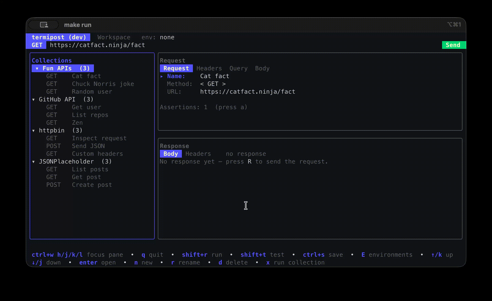

# termipost

[](https://github.com/gabriel-ballesteros/termipost/actions/workflows/ci.yml)
[](https://codecov.io/gh/gabriel-ballesteros/termipost)
[](https://goreportcard.com/report/github.com/gabriel-ballesteros/termipost)
[](https://github.com/gabriel-ballesteros/termipost/releases/latest)
[](https://github.com/gabriel-ballesteros/termipost/releases)
[](go.mod)
[](LICENSE)

A Postman-like HTTP client for the terminal. Build, organize, send, and validate
HTTP requests entirely from the keyboard — no mouse required. Built with
[Bubble Tea](https://github.com/charmbracelet/bubbletea),
[Bubbles](https://github.com/charmbracelet/bubbles), and
[Lip Gloss](https://github.com/charmbracelet/lipgloss).



A single-screen workspace puts the collection tree, the request editor, and the
response side by side — pick a request, tweak it, send, and read the response
without leaving the screen.

## Features

- **Collections** — group related requests; create, rename, delete.
- **Requests** — set method, URL, headers, query params, and body; send and view
  the formatted response (status, headers, pretty-printed JSON body, timing).
- **Body editing** — request and response bodies are syntax-highlighted as JSON.
  Prettify a request body in place with `ctrl+f` (it validates the JSON and
  reports the line/column of any error), with live valid/invalid feedback as you
  type a JSON body.
- **Tests** — attach assertions (status code, header, body, latency) to a
  request and run it as a test. Run a whole collection to get an aggregate
  pass/fail/skip summary. A "test" is just a request with assertions.
- **Environments** — define multiple environments (e.g. `local`, `prod`), each
  with its own variables; switch the active one. References use `{{name}}`.
- **Secrets** — keep tokens and keys in a single gitignored secrets file; values
  are masked everywhere in the UI but sent for real over the wire.
- **Keyboard-only** — every action has a key binding, and the bar at the bottom
  of each screen always shows what is available in the current context.

## Install

### Homebrew (macOS / Linux)

```sh
brew tap gabriel-ballesteros/tap
brew install termipost
```

### Windows / direct download

Download the archive for your platform from the
[latest release](https://github.com/gabriel-ballesteros/termipost/releases/latest)
— `.zip` for Windows, `.tar.gz` for macOS/Linux — extract it, and put the
`termipost` (or `termipost.exe`) binary on your `PATH`.

### Go

```sh
go install github.com/gabriel-ballesteros/termipost@latest
```

Check your version with `termipost --version`.

### Build from source

Requires Go 1.25 or later (matches the version in `go.mod`).

```sh
make build      # produces ./termipost, then run ./termipost
# or
make run        # build and run in one step
```

## Data location

All data is stored as human-readable JSON under your OS config dir, falling
back to `~/.termipost` if that can't be resolved:

- Linux: `~/.config/termipost` (or `$XDG_CONFIG_HOME/termipost`)
- macOS: `~/Library/Application Support/termipost`
- Windows: `%AppData%\termipost` (e.g. `C:\Users\<you>\AppData\Roaming\termipost`)

```
config.json              app settings + active environment
collections/<id>.json    a collection with its requests and assertions
environments/<id>.json   an environment's variables
secrets.json             global secrets (gitignored automatically)
.gitignore               excludes secrets.json
```

Files are safe to read and hand-edit. Malformed files are reported on startup and
skipped rather than overwritten.

## Keys (high level)

- `↑/↓` or `j/k` to move, `enter` to open, `esc` to go back, `q` to quit.
- Collection/environment lists: `n` new, `r` rename, `d` delete; in the
  collection tree `x` runs the whole collection.
- Value editors (params, headers, secrets, assertions): `a` add, `e` edit,
  `d` delete.
- Workspace (request editor): `ctrl+w h/j/k/l` focus a pane, `shift+r` run
  (send and show the response, ignoring assertions), `shift+t` test (send and
  check assertions), `ctrl+s` save, `E` environments.
- Request editor: `tab`/`↑↓` to move between fields (including Assertions),
  `enter` to edit/open the focused field, `←/→` to cycle the method, `[`/`]`
  to switch tabs. Jump straight to a field with its first letter — `n` name,
  `m` method, `u` url, `h` headers, `p` params, `b` body, `a` assertions. On the
  body field, `ctrl+f` prettifies and `space` folds/expands JSON sections.
- Response view: `↑/↓` scroll, `[`/`]` switch tabs, `c` (or `y`) copy the body
  to the clipboard (`ctrl+c` is reserved for quit), `space` fold/expand JSON.
- Environments: `a` set active, `enter` edit variables, `s` secrets.
- Secrets: `a` add, `e` edit, `d` delete, `v` reveal/hide.

The bottom action bar always lists the keys for the current screen.

## Development

```sh
make test       # run unit + TUI smoke tests
make fmt        # gofmt
make vet        # go vet
```
